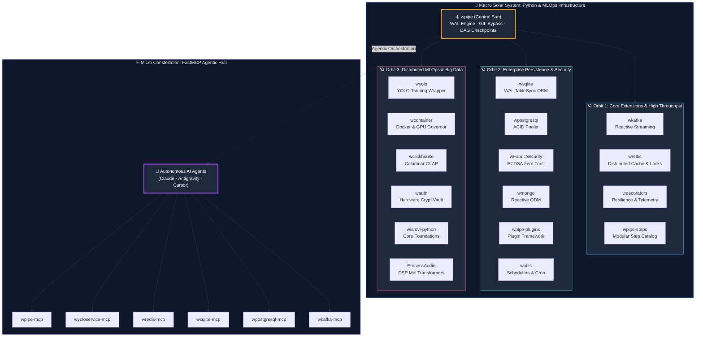

<!-- Header Section -->

  
  
  
  
  

<h1 align="center">William Steve Rodriguez Villamizar (wisrovi)</h1>
<h3 align="center">Principal AI Engineer & Applied AI Solutions Architect | Scientific Researcher</h3>

  <b>Bridging mission-critical production engineering and cutting-edge Artificial Intelligence research. Architect of distributed MLOps clusters, Model Context Protocol (MCP) agentic workflows, and author of 26 peer-reviewed scientific preprints. Based in Badajoz, Spain.</b>

  🌐 <b>Official Research & Software Portal: <a href="https://wisrovi.dev">wisrovi.dev</a></b> | 🆔 <b>ORCID ID: <a href="https://orcid.org/0009-0005-0710-1861">0009-0005-0710-1861</a></b>

---

## 💡 Executive Pitch: Engineering Resilient Ecosystems & Advancing AI Frontiers

In enterprise AI and scientific computing, the critical bottleneck is neither model size nor simple prompting—it is **architectural integrity, statistical safety, and production resilience**.

My work operates at the exact intersection of **hardcore systems engineering** and **rigorous scientific research**:
* **On the Engineering Side**: I engineer distributed, multi-node MLOps platforms, fault-isolated container executors (the Invoker-Executor pattern), asynchronous task routing with Redis priority queues, and maintain **23+ published Python packages on PyPI (37 total ecosystem modules)** coordinated via [`w-cli`](https://github.com/wisrovi/w-cli).
* **On the Scientific Side**: I conduct applied and fundamental research in **Quantitative Explainable AI (XAI)**, **Conformal Prediction**, **In-Training Causal Saliency Regularization**, and **Formal Verification (LTL Model Checking)** for autonomous multi-agent networks.

---

## 🔬 Scientific Research & Peer-Reviewed Preprints (Zenodo / CERN)

Lead investigator of the **wisrovi-suit AI Research Initiative**. All 26 publications feature open reproducible code, mathematical formalization, bootstrap statistical bounds, and official DOIs:

### 🌟 Featured Research Contributions (Featured in ORCID):
1. **Causal Saliency Regularization (CSR)**: Mitigating Clever Hans Artifacts in Deep Object Detectors via In-Training Explainability Penalties — 
2. **Conformal Prediction & Epistemic Uncertainty Decomposition**: Finite-sample coverage guarantees for safety-critical edge vision under representation-level domain shift — 
3. **Formal Verification of Agentic MLOps Workflows**: Model Checking and Liveness Guarantees in Distributed Model Context Protocol (MCP) Workflows — 
4. **Self-Healing Distributed MLOps**: Autonomous Fault Detection, Node Eviction, and Resilient State Reconciliation in Heterogeneous GPU Clusters — 
5. **Zero-Shot Diffusion Purification**: Stochastic Denoising Defense for YOLO Detectors against Transferable Adversarial Attacks — 

*Explore all 26 manuscripts, datasets, and BibTeX citations at [ORCID Record 0009-0005-0710-1861](https://orcid.org/0009-0005-0710-1861).*

---

## 🌟 Flagship Industrial Platform: NeuralForge AI (Distributed MLOps Cluster)

**[NeuralForge AI (wyoloservice2)](https://github.com/wisrovi/wyoloservice2_production)** is an enterprise-grade distributed hyperparameter optimization and computer vision training platform:

* **API Gateway & Monitoring UI (`NeuralForgeAI` / `:23442`)**: React 19 Single Page Application + FastAPI backend managing studies, datasets, and queue telemetry.
* **Datastore Backbone (`wyoloservice2_control_server`)**: Centralized PostgreSQL, Redis queue manager, MinIO S3 object storage, and MLflow server.
* **Evolutionary Optimization Engine (`wyoloservice2_manager`)**: Distributed Optuna genetic loop (TPESampler) proposing parameter trials.
* **Hardware Quota Daemon (`wyoloservice2_invoker`)**: GPU host agent managing VRAM quotas, CIFS mounts, and launching isolated ephemeral Docker execution containers.
* **Ephemeral Training Engine (`wyoloservice2_worker`)**: Dockerized runtime executing the 22-step post-train forensic pipeline (`wpipe`), XAI heatmaps, noise injection, and automated LLM report synthesis.
* **Strict Multi-Queue Priority Routing**: `private_queue (worker_*) > gpus_high > gpus_medium > gpus_low`.

---

## 🌌 The wisrovi SUITE — 23 Official PyPI Packages (Binary Universe Architecture)

Structured as a **Binary Universe**: the Macro Core Python/MLOps Solar System around central sun `wpipe`, and the Micro Constellation of 6 FastMCP servers for autonomous LLM agents (Claude, Antigravity, Cursor).

### 🚀 Featured PyPI Flagships (Most Downloaded & Core Orbits)

Rather than cluttering this overview with all 23 packages, here are the primary workhorses driving production traffic:

| Package | Orbit / Role | Monthly Ingestion | Live PyPI Telemetry | Technical Differentiator |
| :--- | :--- | :---: | :---: | :--- |
| **[`wpipe`](https://github.com/wisrovi/wpipe)** | **Central Sun: Core Engine** | Core Sun |  | In-process DAG orchestrator, zero-infra, SQLite WAL checkpoints, GIL bypass. |
| **[`wkafka`](https://github.com/wisrovi/wkafka)** | **Orbit 1: Event Streaming** | **~1,558 / mo** |  | Reactive Kafka wrapper, declarative `@kafka.consumer` decorators, auto-reconnect. |
| **[`wredis`](https://github.com/wisrovi/wredis)** | **Orbit 1: Cache & Atomicity** | **~798 / mo** |  | Sub-millisecond async Redis caching, atomic distributed locks, token-bucket limiter. |
| **[`wdecorators`](https://github.com/wisrovi/wdecorators)** | **Orbit 1: Resilience** | **~655 / mo** |  | Zero-overhead jittered backoff, microsecond latency profiling, auto-telemetry. |
| **[`wpipe-steps`](https://github.com/wisrovi/wpipe-steps)** | **Orbit 1: Catalog** | **~184 / mo** |  | Production catalog of 196+ standardized, pluggable ETL steps for `wpipe`. |
| **[`wsqlite`](https://github.com/wisrovi/wsqlite)** | **Orbit 2: ACID Persistence** | Enterprise |  | Enterprise SQLite with TableSync reactive migrations and Pydantic v2 ORM. |
| **[`wFabricSecurity`](https://github.com/wisrovi/wFabricSecurity)** | **Orbit 2: Zero Trust** | Enterprise |  | Hardware-grade zero trust, ECDSA P-256 signatures, and SHA-256 payload proofs. |

  📦 <b>Explore all 23 official ecosystem packages and MCP tools on <a href="https://pypi.org/user/wisrovi/">PyPI Profile (@wisrovi)</a> and the interactive portal at <a href="https://wisrovi.dev">wisrovi.dev</a>.</b>

---

## 🛠️ Technical Competencies & Toolchain

<table>
  <tr>
    <td valign="top" width="25%"><b>🧠 Agentic AI & LLMs</b></td>
    <td valign="top" width="75%">Model Context Protocol (MCP), LangGraph, LangChain, Agentic RAG, Semantic Caching, Local LLM Inference (vLLM, Ollama), Groundedness Auditing</td>
  </tr>
  <tr>
    <td valign="top" width="25%"><b>🤖 Vision & Mathematics</b></td>
    <td valign="top" width="75%">YOLO (v8, v11, v26), RT-DETR, PyTorch, Causal Inference, Conformal Prediction, Formal Verification (LTL Model Checking), Grad-CAM/Eigen-CAM, Itô SDEs</td>
  </tr>
  <tr>
    <td valign="top" width="25%"><b>⚡ Programming & Core</b></td>
    <td valign="top" width="75%"><b>Python (Primary Engineering Weapon)</b>, Bash/Shell, C/C++, SQL, TypeScript/JavaScript (ES6+)</td>
  </tr>
  <tr>
    <td valign="top" width="25%"><b>🗄️ Storage & Datastores</b></td>
    <td valign="top" width="75%">PostgreSQL, Redis, MinIO S3, SQLite (WAL mode), ClickHouse, MongoDB, PgVector, Milvus</td>
  </tr>
  <tr>
    <td valign="top" width="25%"><b>🐳 MLOps & Infrastructure</b></td>
    <td valign="top" width="75%">Docker, Celery, MLflow, Optuna, FastMCP, NATS, Linux Kernel Tuning, NVIDIA Container Toolkit, CIFS/Samba, Git CI/CD</td>
  </tr>
</table>

---

## 🎮 Interactive Showcase: Wisrovi Legacy

* **[Wisrovi Legacy (Live Game)](https://wisrovi.github.io)**: A procedural 3D driving RPG built with Vanilla JavaScript and WebGL/Three.js showcasing the libraries and distributed MLOps architecture in an interactive virtual science campus.

---

## 🎯 Doctoral Research Agenda & Theoretical Pillars

As an aspiring Ph.D. candidate, my doctoral research focuses on **Autonomous Verification, Causal Explainability, and Statistical Safety in Distributed Vision Architectures**. I investigate three foundational scientific questions:

1. **Causal Saliency & Shortcut Mitigation:** How can we mathematically penalize non-causal representation shortcuts during gradient descent without sacrificing real-time detection throughput ($mAP_{50}$ vs. Deletion/Insertion AUC Pareto optimality)?
2. **Conformal Prediction under Dynamic Domain Shift:** Establishing finite-sample, distribution-free coverage bounds for deep detectors operating under heavy sensor degradation and non-stationary edge environments.
3. **Formal Verification of Distributed Agentic Workflows:** Synthesizing runtime verification monitors and model checkers based on Linear Temporal Logic (LTL) to guarantee safety, dead-lock freedom, and liveness in autonomous multi-agent tool execution (Model Context Protocol).

---

## 🎓 Academic Credentials & Professional Memberships

* **M.Sc. in Artificial Intelligence** — Universidad Internacional de Valencia (VIU), Spain (2023–2024).
* **B.Sc. in Electronic Engineering** — Universidad de Investigación y Desarrollo (UDI), Colombia (2010–2016).
* **Professional Member** — IEEE Computer Society (Member #9983421).
* **Principal Investigator & Grantee** — wisrovi-suit AI Research Initiative (Badajoz, Extremadura, Spain).

---

  <i>"Rigorous systems engineering in production; uncompromising mathematical rigor in research."</i>

  © 2026 William Steve Rodriguez Villamizar (wisrovi). Distributed under the MIT License. Open for academic research collaborations.

